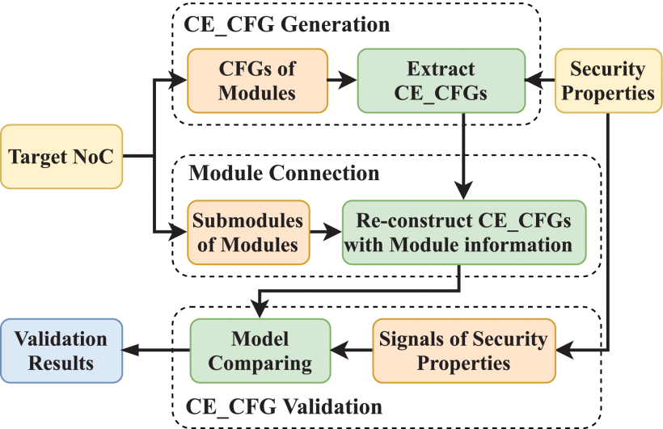

# SeVNoC

## Abstract
Modern System-on-Chip (SoC) designs include a variety of Network-on-Chip (NoC) fabrics to implement coordination and communication of integrated hardware intellectual property (IP) blocks. An important class of security vulnerabilities involves a rogue hardware IP interfering with this communication to compromise the integrity of the system. Such interference includes message mutation, misdirection, delivery prevention, or IP masquerading, among others. In this article, we propose a scalable RTL-level SoC validation scheme, SeVNoC, for the systematic detection of security violations in inter-IP communications for SoC designs with NoC fabrics. Given a target security property to be validated, SeVNoC entails extraction of the control-flow graph of the relevant SoC, which is analyzed through a security property-based model comparison, without incurring state-space explosion. Our experiments on full-scale realistic SoC designs with multiple IPs and NoC architecture indicate that SeVNoC detects security violations in NoC communications with near-perfect accuracy, within only a few minutes.

